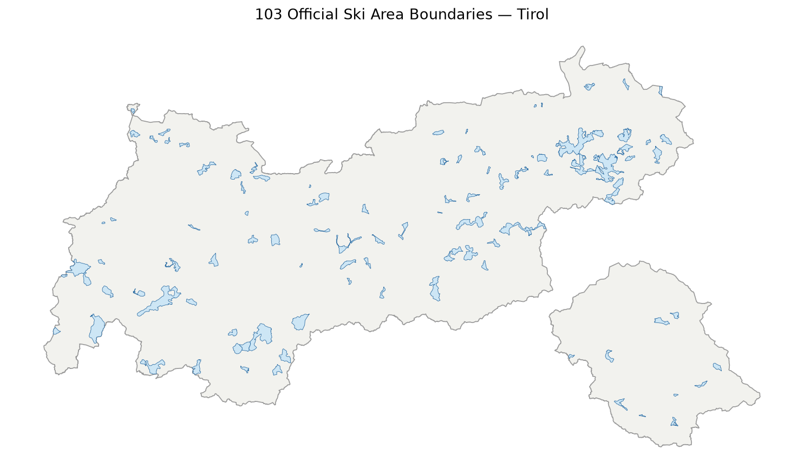
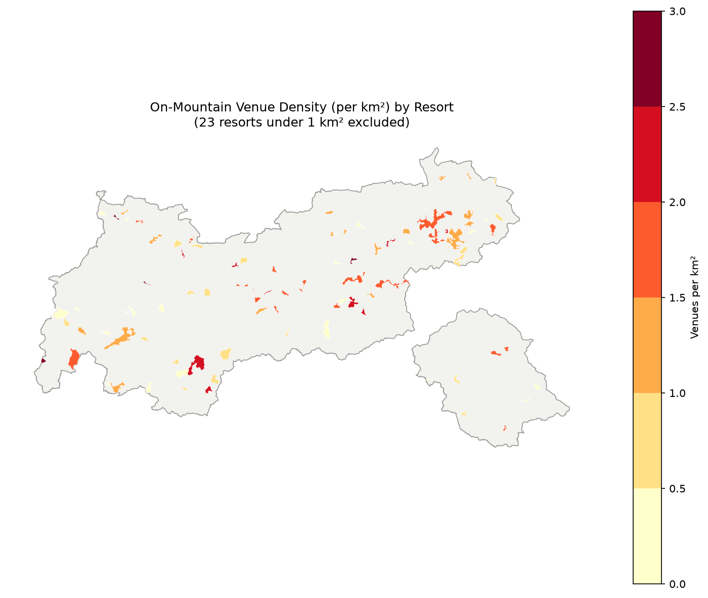

# Tirol Ski Resort Snow-Line Exposure Analysis

Which of Tirol's 103 official ski areas have the most terrain below the region's snow-reliability
line — and how does that compare to how much on-mountain infrastructure (restaurants, bars) each
resort has? A spatial risk analysis combining official government boundaries, crowdsourced piste
data, and cloud-native elevation and points-of-interest data.

Same analytical shape as the [NYC hydrant density project](../nyc-hydrant-analysis): load, explore,
spatial join, normalize, aggregate, export — applied to a genuinely different, climate-relevant
domain.

## What it does

- Loads the **official "URP Schigebietsgrenzen"** boundaries — 103 legally-defined ski areas
  published by Land Tirol, not marketing zones
- Samples elevation every 50m along every mapped piste (OpenStreetMap) using Land Tirol's
  digital terrain model, to compute what share of each resort's piste length lies below the
  **1800m snow-reliability threshold** (per GeoSphere Austria research)
- Computes **on-mountain venue density** — restaurants and bars within 100m of an actual piste,
  not just anywhere inside the resort boundary — normalized by area, the same way hydrant density
  was computed per neighborhood
- Exports the combined result as GeoParquet

## Data sources — genuinely multi-database, not just multi-website

| Source | What it provides | Access method |
|---|---|---|
| Land Tirol (URP Schigebietsgrenzen) | Official ski area boundaries | ArcGIS Hub REST API |
| OpenStreetMap | Piste geometry + difficulty | Overpass API |
| Overture Maps (Places theme) | Restaurants & bars | DuckDB querying Parquet on S3 |
| Land Tirol (tiris) | Digital terrain model (5m DGM) | WCS (Web Coverage Service) |

Three architecturally different backends — a REST download, a graph query API, and a cloud-native
columnar query engine — feeding one analysis. The elevation data traces back to an airborne
laser-scan survey **co-financed through EU Interreg III/IV**.

## Setup

```bash
python -m venv .venv
source .venv/bin/activate
pip install -r requirements.txt
```

Run `00_fetch_data.py` once to cache all data sources locally (~90 seconds):
```bash
python 00_fetch_data.py
```

Then open and run `tirol_snowline_analysis.ipynb` top to bottom. It reads only from the local
files `00_fetch_data.py` produced — no network calls in the notebook itself.

## Findings

**Zero exposure — genuinely snow-secure terrain.** Nine resorts show 0% of piste length below
1800m: Stablein - Vent, Pitztaler Gletscher, Kaunertaler Gletscher, Kühtai, Albonagrat - St. Anton,
Obergurgl, Lämmerbichl-Rastkogel - Tux, Staller Sattel - St. Jakob in Defereggen, and the
Ötztal-Pitztal glacier connection — all either glacier resorts or high-altitude terrain. Hochgurgl
rounds out the top 10 at just 0.4% (0.2 of 42 km). The ranking by % and by absolute km is nearly
identical for this group, which cross-validates the result regardless of how exposure is measured.

**Most "safe" terrain in absolute km (above 1800m, by difficulty).** Komperdell
(Serfaus-Fiss-Ladis) leads with 324 km of piste above the threshold — dominated by intermediate
terrain (201.6 km) — followed by Silvretta Schiarena / Ischgl-Samnaun (315 km) and Ötztaler
Gletscher / Sölden (206 km). These are Tirol's largest high-altitude resort systems, not
necessarily its most snow-secure by percentage — a resort can have huge safe terrain in absolute
km while still having significant exposed terrain too.

**Most on-mountain venues (raw count).** Schiwelt Wilder Kaiser-Brixental (62), Ötztaler Gletscher
/ Sölden (61), Hahnenkamm-Ehrenbachhöhe / part of KitzSki (41), Komperdell / Serfaus-Fiss-Ladis
(40), Silvretta Schiarena / Ischgl-Samnaun (35) — Tirol's five largest, most commercially
developed resorts.

**Highest venue density per km².** Neunerköpfle-Tannheim (3.52), Spieljoch (3.25),
Birkhahn-Galtür (3.18), Hochimst (2.67), Marienbergjoch (2.48) — a mostly different, smaller
set of resorts than the raw-count leaders. Notably, Ötztaler Gletscher / Sölden appears at #7
(2.39/km²) despite its huge absolute size — it's genuinely densely developed, not just big.

**Headline comparison — scale vs. intensity.** Raw venue count and density-per-km² tell different
stories: the biggest resorts dominate by sheer volume of infrastructure, but several much smaller,
less-marketed resorts are more intensively developed per square kilometer. Meanwhile, the
snow-security picture is dominated almost entirely by glacier and high-altitude resorts — exactly
the terrain that's naturally too high and too remote to have built up dense on-mountain venue
infrastructure in the first place. Full results for every resort, including the complete
most-to-least exposure ranking, are in the CSV files alongside this notebook.




## Methodology notes & honest limitations

- **Official names differ from marketing names.** The government dataset defines 103 legally
  separate ski areas, several of which correspond to one marketed "combined" resort (e.g.
  "Komperdell" = Serfaus-Fiss-Ladis; "Hahnenkamm - Ehrenbachh\u00f6he" = part of KitzSki). No
  name-mapping table is applied; results are reported under the official names.
- **9 of 103 resorts have no result** — OSM has no `piste:type` lines mapped inside their
  official boundary (likely small, single-lift local areas). 94/103 (91%) coverage.
- **Venue density excludes resorts under 1 km\u00b2.** The official boundary dataset contains at
  least one degenerate polygon (~0.00002 km\u00b2) that would otherwise produce a nonsensical density
  in the tens of thousands per km\u00b2. This is a data artifact in the source, not a modeling choice.
- **The 1800m threshold is a single current estimate**, not a precise scientific regression.
  GeoSphere Austria's research places the snow-reliability line in an 1800\u20132000m range; a
  month-by-month or year-by-year snowline would require deriving it from raw station temperature
  data via the GeoSphere Data Hub API (real, documented, CC BY 4.0 \u2014 a natural next step, not
  built here to keep scope focused).
- **Official rescue-station and hazard-zone data exist but are access-restricted** (tiris OEI
  requires registered-responder login; WLV Gefahrenzonenpl\u00e4ne are view-only). This is why the
  project uses OSM + Overture rather than those sources.

## Troubleshooting

**`OPENSSL_3.2.0 not found` errors from GDAL on Linux:** a common library-linking conflict when
conda and venv environments coexist in the same shell. The notebook's setup cell clears the
relevant environment variables (`GDAL_DRIVER_PATH`, `GDAL_DATA`, etc.) automatically. If it still
appears, avoid activating a conda environment in the same terminal session as this project's venv.

**`ImportError: pyarrow.parquet`:** `pip install pyarrow` (already in requirements.txt).

## What I learned

[TODO]

## Stack

Python, GeoPandas, DuckDB, rasterio, matplotlib, Overpass API, Overture Maps, tiris WCS.

## License

MIT
